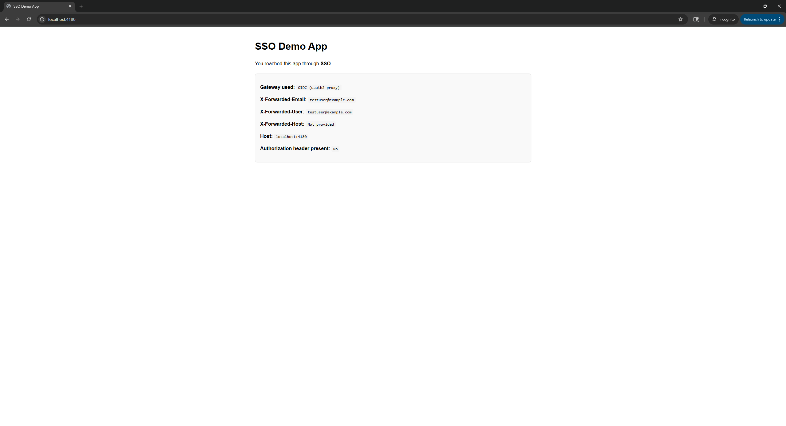
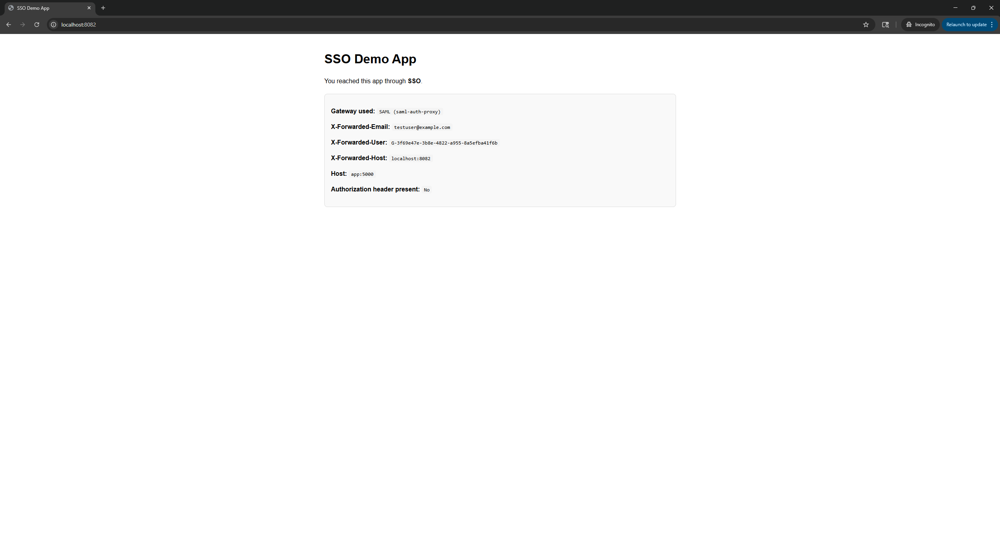
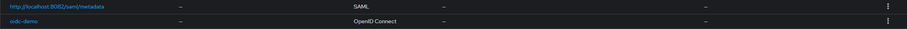

# SSO Interoperability Lab

A self-contained Docker Compose lab demonstrating Single Sign-On using [Keycloak](https://www.keycloak.org/) as the Identity Provider, with two authentication protocols protecting the same backend application simultaneously:

- **OIDC (OpenID Connect)** via [oauth2-proxy](https://github.com/oauth2-proxy/oauth2-proxy) — port `4180`
- **SAML 2.0** via [saml-auth-proxy](https://github.com/itzg/saml-auth-proxy) — port `8082`

---

## Architecture

```
Browser
  ├── http://localhost:4180  →  oauth2-proxy    →  Flask app
  └── http://localhost:8082  →  saml-auth-proxy →  Flask app

Both proxies authenticate against Keycloak (http://localhost:8080)
The Flask app reads forwarded identity headers to show who is logged in
```

### Services

| Service | Image | Port |
|---|---|---|
| `postgres` | postgres:16 | internal |
| `keycloak` | keycloak:26.0.0 | 8080 |
| `app` | ./flask-app | internal |
| `oauth2-proxy` | oauth2-proxy:v7.6.0 | 4180 |
| `saml-proxy` | saml-auth-proxy:1.17.6 | 8082 |

---

## Prerequisites

- Docker and Docker Compose
- A hosts file entry mapping `keycloak` to `127.0.0.1` (required for SAML browser redirects — see Setup)

---

## Setup

### 1. Clone the repository

```bash
git clone https://github.com/robert-arutyunov/sso-interop-lab.git
cd sso-interop-lab
```

### 2. Add `keycloak` to your hosts file

The SAML proxy redirects the browser to Keycloak using its internal Docker hostname. Your OS needs to resolve that hostname.

**Windows** — open Notepad as Administrator, then open `C:\Windows\System32\drivers\etc\hosts` and add:

```
127.0.0.1 keycloak
```

**macOS/Linux:**

```bash
sudo sh -c 'echo "127.0.0.1 keycloak" >> /etc/hosts'
```

### 3. Generate the SAML proxy certificate

Create the directory and generate a self-signed certificate:

```bash
mkdir -p saml-proxy

docker run --rm -v ${PWD}/saml-proxy:/work -w /work alpine/openssl \
  req -x509 -newkey rsa:2048 \
  -keyout saml-auth-proxy.key \
  -out saml-auth-proxy.cert \
  -days 365 \
  -nodes \
  -subj "/CN=localhost"
```

### 4. Create the `.env` file

Create a `.env` file in the project root:

```env
OAUTH2_PROXY_CLIENT_SECRET=<your-keycloak-oidc-client-secret>
OAUTH2_PROXY_COOKIE_SECRET=<random-32-byte-base64-string>
```

To generate a valid cookie secret:

```powershell
# PowerShell
$bytes = New-Object byte[] 32
(New-Object System.Security.Cryptography.RNGCryptoServiceProvider).GetBytes($bytes)
[Convert]::ToBase64String($bytes)
```

```bash
# Bash
python3 -c "import secrets, base64; print(base64.urlsafe_b64encode(secrets.token_bytes(32)).decode())"
```

> The cookie secret must decode to exactly 32 bytes. Verify with:
> `[Convert]::FromBase64String($secret).Length` — must return `32`.

### 5. Configure Keycloak

Start only Keycloak first:

```bash
docker compose up -d postgres keycloak
```

Open [http://localhost:8080](http://localhost:8080) and log in with `admin` / `adminpass`.

**Create the realm and clients:**

1. **Create a realm** named `sso-lab`

2. **Create the OIDC client:**
   - Client type: OpenID Connect
   - Client ID: `oidc-demo`
   - Client authentication: ON (confidential)
   - Standard flow: ON
   - Valid redirect URIs: `http://localhost:4180/oauth2/callback`
   - Web origins: `http://localhost:4180`
   - Copy the client secret (Credentials tab) into your `.env` file

3. **Add an Audience mapper** — without this, oauth2-proxy rejects the token with an audience mismatch error:
   - Clients → `oidc-demo` → Client scopes → `oidc-demo-dedicated` → Mappers
   - Add mapper → Audience
   - Name: `audience-oidc-demo`
   - Included Client Audience: `oidc-demo`
   - Add to ID token: ON, Add to access token: ON

4. **Create the SAML client by importing SP metadata:**
   - Start the full stack first (`docker compose up -d`) so the saml-proxy is reachable
   - Clients → Create client → Client type: SAML → Import from URL
   - URL: `http://localhost:8082/saml/metadata`

5. **Create a test user:**
   - Users → Add user → set username, email address, and password
   - Email verified: ON

### 6. Start all services

```bash
docker compose up -d
```

---

## Usage

| URL | Protocol | What happens |
|---|---|---|
| [http://localhost:4180](http://localhost:4180) | OIDC | Redirects to Keycloak → login → Flask app |
| [http://localhost:8082](http://localhost:8082) | SAML | Redirects to Keycloak → login → Flask app |

Both routes reach the same Flask app, which displays the identity headers forwarded by the proxy and detects which gateway was used based on the port.

## Screenshots

**OIDC path (localhost:4180)**


**SAML path (localhost:8082)**


**Keycloak — both clients registered**


### Example output — OIDC path

```
Gateway used:              OIDC (oauth2-proxy)
X-Forwarded-Email:          testuser@example.com
X-Forwarded-User:           testuser@example.com
X-Forwarded-Host:           Not provided
Authorization header:       No
```

### Example output — SAML path

```
Gateway used:              SAML (saml-auth-proxy)
X-Forwarded-Email:          testuser@example.com
X-Forwarded-User:           G-04ce1f57-5dcb-4e77-b67b-02efae634cf0
X-Forwarded-Host:           localhost:8082
Authorization header:       No
```

---

## How the authentication flows work

### OIDC — Authorization Code Flow

1. Browser hits `localhost:4180`
2. oauth2-proxy checks for a session cookie — none found
3. Browser is redirected to Keycloak's OIDC authorization endpoint (`localhost:8080`)
4. User logs in; Keycloak returns an authorization code to the callback URL
5. oauth2-proxy exchanges the code for tokens (server-to-server via `keycloak:8080`)
6. oauth2-proxy creates an encrypted session cookie
7. Request is forwarded to Flask with `X-Forwarded-User`, `X-Forwarded-Email`, and `Authorization` headers

### SAML — HTTP POST Binding

1. Browser hits `localhost:8082`
2. saml-auth-proxy redirects the browser to Keycloak's SAML SSO endpoint
3. User logs in; Keycloak posts a signed SAML assertion to the proxy's ACS URL
4. saml-auth-proxy validates the assertion using the SP certificate
5. Request is forwarded to Flask with `X-Forwarded-User` and `X-Forwarded-Email` mapped from SAML attributes

---

## Project structure

```
.
├── docker-compose.yml
├── .env                      # not committed — secrets go here
├── .gitignore
├── flask-app/
│   ├── app.py                # reads and displays forwarded identity headers
│   ├── requirements.txt
│   └── Dockerfile
└── saml-proxy/
    ├── saml-auth-proxy.cert  # SP certificate — generated locally, not committed
    └── saml-auth-proxy.key
```

---

## Stopping and resuming

```bash
# Stop all containers (Postgres data is preserved in the named volume)
docker compose down

# Start everything again
docker compose up -d
```

> **Do not run `docker compose down -v`** — this deletes the Postgres volume and wipes your Keycloak realm, users, and client configuration.

---

## Notable implementation details

### Internal vs external hostnames

Docker containers communicate using service names (`keycloak:8080`), but the browser can only reach `localhost:8080`. This required splitting the OIDC proxy configuration:

- oauth2-proxy uses `keycloak:8080` for server-to-server calls (token exchange, JWKS, userinfo)
- oauth2-proxy sends the browser to `localhost:8080` via an explicit `OAUTH2_PROXY_LOGIN_URL`
- OIDC discovery is skipped (`OAUTH2_PROXY_SKIP_OIDC_DISCOVERY: "true"`) so all endpoints are set explicitly
- For SAML, adding `keycloak` to the hosts file lets the browser resolve the same hostname that the container uses

### OIDC audience claim

Keycloak does not automatically include the client ID in the token `aud` claim. Without an Audience mapper, oauth2-proxy rejects the token with:

```
audience from claim aud with value [account] does not match with any of allowed audiences map[oidc-demo:{}]
```

### Service startup ordering

The SAML proxy fetches Keycloak's SAML metadata descriptor on startup. `depends_on` with `condition: service_healthy` and `restart: unless-stopped` ensure it waits for Keycloak and retries automatically if startup fails.

### Cookie secret byte length

oauth2-proxy requires the cookie secret to decode to exactly 16, 24, or 32 bytes. A base64 string's character length does not equal its decoded byte length — always verify before use.

---

## Tech stack

| Component | Role |
|---|---|
| Keycloak 26 | Identity Provider (OIDC + SAML) |
| oauth2-proxy v7.6 | OIDC authentication gateway |
| saml-auth-proxy 1.17.6 | SAML authentication gateway |
| Flask | Backend demo application |
| PostgreSQL 16 | Keycloak persistence |
| Docker Compose | Orchestration |